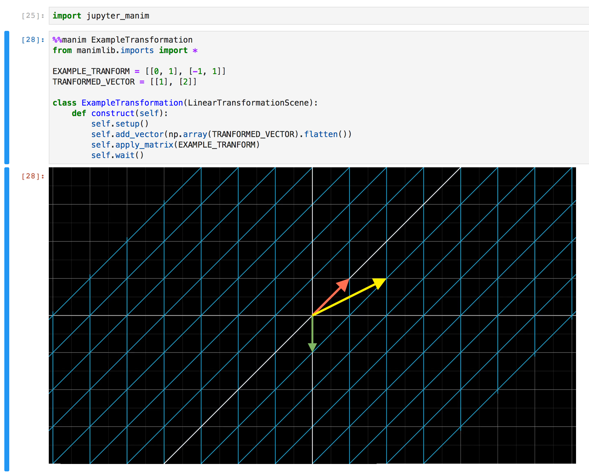

# `nicklarsennz/jupyter-manim`

_Jupyter Lab with [3b1b/manim][manim] integration thanks to [krassowski/jupyter-manim][jupyter-manim]_



## Run

**quickstart**

_Note, no data will be saved and the container will auto-remove once it's stopped._

```sh
docker run --rm nicklarsennz/jupyter-manim
```

Then visit <http://localhost:8999>

**mount notebooks (read-write)**

_If you want to save notebooks, or access existing notebooks._

```sh
docker run --rm -v $HOME/notebooks:/data:rw nicklarsennz/jupyter-manim
```

Then visit <http://localhost:8999>

**Change the exposed port**

_If you need to expose the container on a different port._

```sh
PORT=8000 docker run --rm -p ${PORT}:8080 -e EXTERNAL_PORT=${PORT} nicklarsennz/jupyter-manim
```

Then visit <http://localhost:8000>

## Working Example

**Mandatory import at the start of the notebook**
```py
import jupyter_manim
```

**Simple Shapes Scene**

```py
%%manim Shapes
from manimlib.imports import *

class Shapes(Scene):

    def construct(self):
        circle = Circle()
        square = Square()
        self.play(ShowCreation(circle))
        self.play(Transform(circle, square))
        self.play(GrowFromCenter(square))
```

**Linear Transformation Scene**

```py
%%manim ExampleTransformation
from manimlib.imports import *

EXAMPLE_TRANFORM = [[0, 1], [-1, 1]]
TRANFORMED_VECTOR = [[1], [2]]

class ExampleTransformation(LinearTransformationScene):
    def construct(self):
        self.setup()
        self.add_vector(np.array(TRANFORMED_VECTOR).flatten())
        self.apply_matrix(EXAMPLE_TRANFORM)
        self.wait()
```

[manim]: https://github.com/3b1b/manim
[jupyter-manim]: https://github.com/krassowski/jupyter-manim